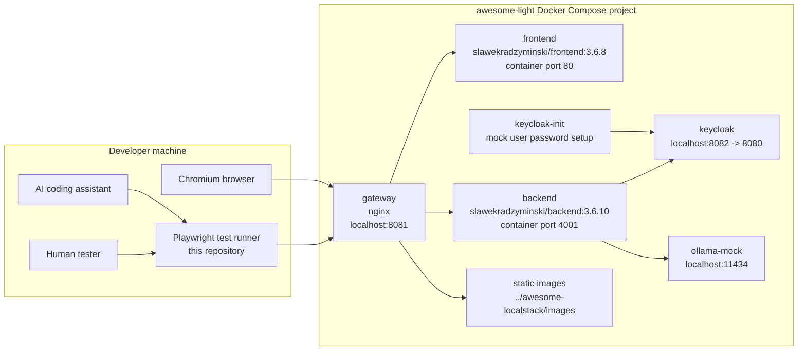
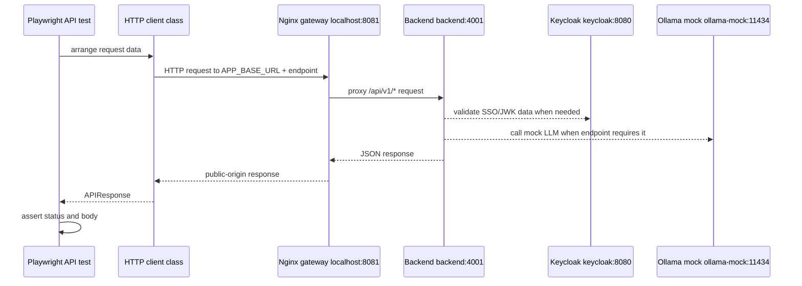
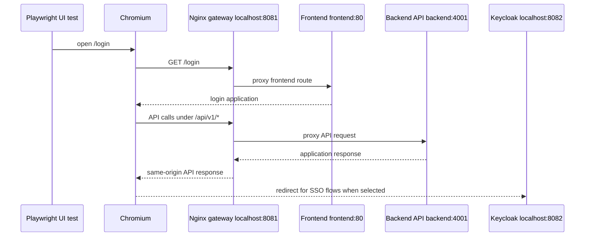
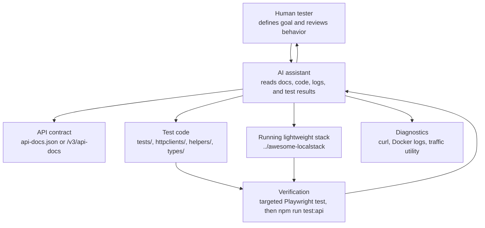
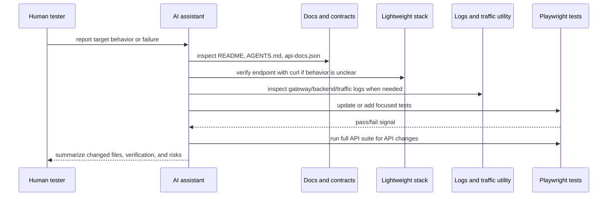

# System Under Test Architecture

This project tests the `../awesome-localstack/lightweight-docker-compose.yml` stack. The stack is intentionally gateway-first: tests and browsers enter through `http://localhost:8081`, and the gateway decides whether traffic goes to the frontend, backend API, Swagger/OpenAPI, actuator endpoints, or static images.

## Scope

The System Under Test is the lightweight local stack, not this Playwright repository itself.

- test runner: this repository, using Playwright API and UI tests
- compose file: `../awesome-localstack/lightweight-docker-compose.yml`
- gateway URL: `http://localhost:8081`
- Keycloak URL: `http://localhost:8082`
- Ollama mock URL: `http://localhost:11434`

The backend container exposes port `4001` only inside the Docker network. Tests should not call `4001` directly.

## Container Topology



## Gateway Routing

The Nginx gateway in `../awesome-localstack/nginx/conf.d/lightweight-app-gateway.conf` provides one public application origin.

| Public route | Target |
| --- | --- |
| `/` and frontend routes | `frontend:80` |
| `/api/v1/` | `backend:4001` |
| `/api/v1/ws-traffic` | `backend:4001` with WebSocket upgrade headers |
| `/swagger-ui/` | `backend:4001` |
| `/v3/api-docs` | `backend:4001` |
| `/actuator/` | `backend:4001` |
| `/images/` | static files mounted from `../awesome-localstack/images` |

This means API tests should build URLs from `APP_BASE_URL`, and `APP_BASE_URL` should normally be `http://localhost:8081`.

## Runtime Responsibilities

- `gateway` is the public entry point for UI and API traffic.
- `frontend` serves the browser application behind the gateway.
- `backend` serves application APIs, Swagger/OpenAPI, actuator endpoints, and integration points used by tests.
- `keycloak` provides the local `awesome-testing` realm for SSO flows.
- `keycloak-init` waits for Keycloak and sets passwords for mock social-login users.
- `ollama-mock` provides a deterministic local replacement for the LLM service.

The backend runs with the `local` Spring profile and SSO enabled. It uses the browser-facing issuer `http://localhost:8082/realms/awesome-testing` and the Docker-network JWK endpoint `http://keycloak:8080/realms/awesome-testing/protocol/openid-connect/certs`.

## API Test Flow



API tests should keep transport details inside `httpclients/` and keep test files focused on given, when, then steps. Endpoint documentation can be checked through `api-docs.json` in this repository or the live gateway endpoint at `http://localhost:8081/v3/api-docs`.

## UI Test Flow



UI tests should still start from `http://localhost:8081`; SSO browser redirects may leave that origin temporarily to use Keycloak on `http://localhost:8082`.

## Human And AI Cooperation

The project is structured so a human tester and an AI coding assistant can work from the same observable system: compose files, OpenAPI docs, gateway behavior, traffic logs, backend code, and Playwright test output.



Recommended cooperation loop:

1. Human states the endpoint or behavior to test.
2. AI checks the OpenAPI contract, existing client/test patterns, and current gateway behavior.
3. AI adds or updates shared types, helpers, HTTP clients, and focused tests.
4. AI runs the new test first, then the full API suite when API tests are changed.
5. Human reviews the result, the test intent, and any unresolved behavior questions.

## Human And AI Debugging Loop



Use `CLI_TRAFFIC_LOGS_UTILITY.md` when a response needs correlation with backend-side traffic. Use `../test-secure-backend` when the endpoint behavior cannot be understood from OpenAPI and observed responses alone.

## Quick Checks

From `../awesome-localstack`:

```bash
docker compose -f lightweight-docker-compose.yml ps
curl -i http://localhost:8081/login
curl -i http://localhost:8081/v3/api-docs
curl -i http://localhost:8081/images/iphone.png
curl -i http://localhost:8082/realms/awesome-testing/.well-known/openid-configuration
curl -i http://localhost:11434/api/tags
```

From this repository:

```bash
APP_BASE_URL=http://localhost:8081 npm run test:api
```
