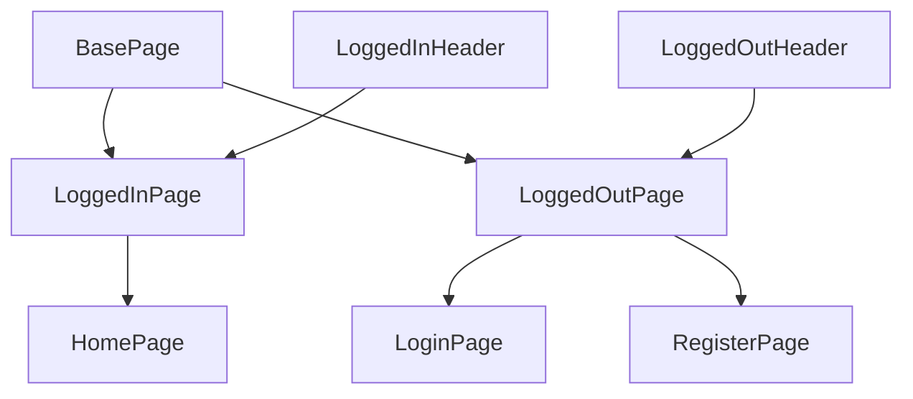

# 🧪 Test Automation in Practice 2025

A modern TypeScript-based test suite for validating both API and UI layers of a Dockerized AWS-like application stack, powered by awesome-localstack.

## 📦 Project Overview

This repository contains a comprehensive suite of automated tests using Playwright to validate the functionality of a full-stack application running in a local AWS-like environment provided by awesome-localstack.

## 🔧 Features

- **API Testing**: Validates authentication endpoints with various scenarios, including successful logins and error handling.
- **UI Testing**: Ensures the login interface behaves correctly, covering form validations, navigation, and accessibility.
- **TypeScript Support**: Utilizes TypeScript for type safety and better developer experience with dedicated types in `/types` folder.
- **Dockerized Environment**: Tests are designed to run against services provided by the awesome-localstack Docker setup.

## 🗂️ Project Structure

```
.
├── tests/
│   ├── api/
│   │   └── login.api.spec.ts       # API tests for /users/signin endpoint
│   └── ui/
│       └── login.ui.spec.ts        # UI tests for the login page
├── types/
│   └── auth.ts                     # TypeScript interfaces for authentication
├── playwright.config.ts            # Playwright configuration
├── package.json                    # Project metadata and dependencies
└── ...
```

## 🏗️ Page Object Architecture

The project follows the Page Object Model (POM) pattern with a clear inheritance hierarchy:



### Key Design Principles

- **BasePage**: Abstract base class providing common functionality (navigation, URL assertions, toast messages)
- **LoggedInPage**: Abstract class for authenticated pages, includes `LoggedInHeader` component
- **LoggedOutPage**: Abstract class for unauthenticated pages (login, register)
- **Components**: Reusable UI components like `LoggedInHeader` and `ToastComponent`

## 🚀 Getting Started

### Prerequisites

- Node.js LTS, Recommended `v22.16.0`
- Docker

### Setup

1. **Clone the Repository**

```bash
git clone https://github.com/slawekradzyminski/playwright-may-2025
cd playwright-may-2025
```

2. **Install Dependencies**

```bash
npm install
npx playwright install chromium
```

3. **Start the Dockerized Environment**

Follow the instructions in the awesome-localstack repository to set up and start the Docker containers. Ensure the following services are running:

- **Frontend**: Accessible at http://localhost:8081
- **Backend API**: Accessible at http://localhost:4001

4. **Run Tests**

**API Tests**

```bash
npm run test:api
# or
npx playwright test tests/api/login.api.spec.ts
```

**UI Tests**

```bash
npm run test:ui
# or
npx playwright test tests/ui/login.ui.spec.ts
```

**All Tests**

```bash
npm test
# or
npx playwright test
```

## ⚙️ Configuration

The `playwright.config.ts` file is configured to:

- Run tests in parallel for faster execution
- Use Chromium browser for UI tests
- Collect trace information on the first retry of a failed test
- Use list reporter for test output
- Retry failed tests on CI (up to 2 retries)
- Use single worker on CI, parallel workers locally

## 🧪 Test Details

### API Tests (`tests/api/login.api.spec.ts`)

These tests cover various scenarios for the `/users/signin` endpoint, ordered by response code:

- **Successful Authentication (200)**: Valid credentials return a 200 status with a JWT token and complete user information
- **Validation Errors (400)**: Tests for empty username, short username, and short password scenarios with appropriate error messages
- **Authentication Errors (422)**: Invalid credentials result in 422 status codes with error messages

### UI Tests (`tests/ui/login.ui.spec.ts`)

These tests validate the login page's functionality and user experience:

- **Successful Login**: Valid credentials redirect the user away from the login page
- **Form Validation**: Empty password and invalid credentials keep the user on the login page
- **Navigation**: Clicking on "Register" buttons or links navigates to the registration page
- **Input Validation**: Short username validation prevents form submission

## 🧰 Technologies Used

- **Playwright**: End-to-end testing framework for web applications
- **TypeScript**: Typed superset of JavaScript
- **Docker**: Containerization platform
- **awesome-localstack**: Dockerized local AWS environment for development and testing

## Playwright MCP

Read more about Playwright MCP here: https://github.com/microsoft/playwright-mcp

## 📝 License

This project is licensed under the ISC License.

For more information on setting up and using the Dockerized environment, refer to the awesome-localstack repository.