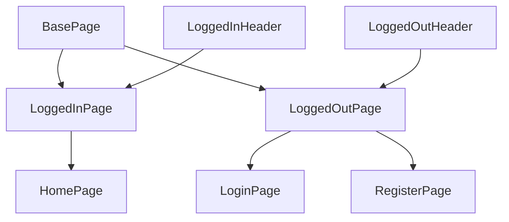

# 🧪 Test Automation in Practice 2025

A modern TypeScript-based test suite for validating both API and UI layers of a Dockerized AWS-like application stack, powered by awesome-localstack.

## 📦 Project Overview

This repository contains a comprehensive suite of automated tests using Playwright to validate the functionality of a full-stack application running in a local AWS-like environment provided by awesome-localstack.

## 🔧 Features

- **Comprehensive API Testing**: Full coverage of REST endpoints including authentication, user management, product operations, and system configuration
- **End-to-End UI Testing**: Validates user journeys across multiple pages including home, products, profile, cart, and specialized features (QR codes, email, LLM, traffic monitoring)
- **Advanced Test Fixtures**: Custom Playwright fixtures for both API and UI authentication with role-based access (admin/client)
- **Type-Safe Architecture**: TypeScript interfaces for all DTOs (auth, product, user) located in `/types` folder
- **Page Object Model**: Clean inheritance hierarchy with abstract base classes and reusable components
- **Test Data Generators**: Faker-based generators for creating realistic test data
- **HTTP Client Abstraction**: Dedicated client modules for each API endpoint in `/http` folder
- **Dockerized Environment**: Tests run against services provided by the awesome-localstack Docker setup

## 🗂️ Project Structure

```
.
├── tests/
│   ├── api/                        # API test specifications
│   │   ├── login.api.spec.ts       # Authentication: sign in
│   │   ├── register.api.spec.ts    # Authentication: user registration
│   │   ├── refresh.api.spec.ts     # Authentication: token refresh
│   │   ├── me.api.spec.ts          # Current user information
│   │   ├── products.api.spec.ts    # Product creation
│   │   ├── get-all-products.api.spec.ts
│   │   ├── get-product-by-id.api.spec.ts
│   │   ├── update-product.api.spec.ts
│   │   ├── delete-product.api.spec.ts
│   │   ├── users.api.spec.ts       # User management
│   │   ├── user-by-username.api.spec.ts
│   │   ├── update-user.api.spec.ts
│   │   ├── delete-user.api.spec.ts
│   │   ├── get-system-prompt.api.spec.ts
│   │   └── update-system-prompt.api.spec.ts
│   └── ui/                         # UI test specifications
│       ├── login.ui.spec.ts        # Login page flows
│       ├── register.ui.spec.ts     # Registration page flows
│       ├── home.ui.spec.ts         # Home page navigation
│       └── logged.in.header.ui.spec.ts  # Header navigation
├── pages/                          # Page Object Model
│   ├── abstract/
│   │   ├── basePage.ts             # Base page with common functionality
│   │   ├── loggedInPage.ts         # Authenticated pages base
│   │   └── loggedOutPage.ts        # Unauthenticated pages base
│   ├── components/
│   │   ├── loggedInHeader.ts       # Header for authenticated users
│   │   ├── loggedOutHeader.ts      # Header for guests
│   │   └── toastComponent.ts       # Toast notifications
│   ├── homePage.ts
│   ├── loginPage.ts
│   ├── registerPage.ts
│   ├── productsPage.ts
│   ├── usersPage.ts
│   ├── profilePage.ts
│   ├── cartPage.ts
│   ├── emailPage.ts
│   ├── qrPage.ts
│   ├── llmPage.ts
│   └── trafficPage.ts
├── http/                           # HTTP client modules
│   ├── loginClient.ts
│   ├── registerClient.ts
│   ├── refreshClient.ts
│   ├── meClient.ts
│   ├── productsClient.ts
│   ├── getAllProductsClient.ts
│   ├── getProductByIdClient.ts
│   ├── updateProductClient.ts
│   ├── deleteProductClient.ts
│   ├── usersClient.ts
│   ├── userByUsernameClient.ts
│   ├── updateUserClient.ts
│   ├── deleteUserClient.ts
│   ├── getSystemPromptClient.ts
│   └── updateSystemPromptClient.ts
├── fixtures/                       # Test fixtures
│   ├── apiAuthFixture.ts           # API authentication fixtures
│   ├── uiAuthFixture.ts            # UI authentication fixtures
│   └── authHelpers.ts              # Shared auth utilities
├── generators/                     # Test data generators
│   ├── userGenerator.ts            # User data generation with Faker
│   └── productGenerator.ts         # Product data generation with Faker
├── types/                          # TypeScript type definitions
│   ├── auth.ts                     # Authentication DTOs
│   ├── user.ts                     # User DTOs
│   └── product.ts                  # Product DTOs
├── config/
│   └── constants.ts                # Environment constants
├── playwright.config.ts            # Playwright configuration
└── package.json                    # Project metadata and dependencies
```

## 🏗️ Page Object Architecture

The project follows the Page Object Model (POM) pattern with a clear inheritance hierarchy:



### Key Design Principles

- **BasePage**: Abstract base class providing common functionality (navigation, URL assertions, toast messages)
- **LoggedInPage**: Abstract class for authenticated pages, includes `LoggedInHeader` component for navigation
- **LoggedOutPage**: Abstract class for unauthenticated pages, includes `LoggedOutHeader` component
- **Components**: Reusable UI components like `LoggedInHeader`, `LoggedOutHeader`, and `ToastComponent`
- **Specific Pages**: Concrete implementations for each application page (HomePage, LoginPage, ProductsPage, etc.)

## 🚀 Getting Started

### Prerequisites

- Node.js LTS, Recommended `v22.16.0`
- Docker

### Setup

1. **Clone the Repository**

```bash
git clone https://github.com/slawekradzyminski/playwright-may-2025
cd playwright-may-2025
```

2. **Install Dependencies**

```bash
npm install
npx playwright install chromium
```

3. **Start the Dockerized Environment**

Follow the instructions in the awesome-localstack repository to set up and start the Docker containers. Ensure the following services are running:

- **Frontend**: Accessible at http://localhost:8081
- **Backend API**: Accessible at http://localhost:4001

4. **Run Tests**

**All Tests**

```bash
npm test
# or
npx playwright test
```

**API Tests Only**

```bash
npm run test:api
# or
npx playwright test tests/api/
```

**UI Tests Only**

```bash
npm run test:ui
# or
npx playwright test tests/ui/
```

**Single Test File**

```bash
npx playwright test tests/api/login.api.spec.ts
npx playwright test tests/ui/home.ui.spec.ts
```

**Debug Mode**

```bash
npx playwright test --debug
npx playwright test tests/ui/login.ui.spec.ts --debug
```

## 🎯 Application Features Tested

The test suite validates a full-featured e-commerce and management platform:

### Core Features
- **Authentication & Authorization**: JWT-based login/registration with role-based access control (admin/client)
- **Product Management**: CRUD operations for products with inventory tracking
- **User Management**: Admin capabilities for viewing, updating, and deleting users
- **Shopping Cart**: Cart functionality for authenticated users
- **User Profile**: Profile viewing and order history

### Advanced Features
- **Email Service**: Email sending capabilities
- **QR Code Generation**: Dynamic QR code creation
- **AI Assistant (LLM)**: Integration with language model functionality
- **Traffic Monitor**: Real-time traffic monitoring dashboard
- **System Configuration**: Admin-level system prompt management

## ⚙️ Configuration

The `playwright.config.ts` file is configured to:

- Run tests in parallel for faster execution
- Use Chromium browser for UI tests
- Collect trace information on the first retry of a failed test
- Use list reporter for test output
- Retry failed tests on CI (up to 2 retries)
- Use single worker on CI, parallel workers locally

### Environment Configuration

The `config/constants.ts` file defines:
- `API_BASE_URL`: Backend API endpoint (default: http://localhost:4001)
- `FRONTEND_URL`: Frontend application URL (default: http://localhost:8081)

## 🧪 Test Details

### API Test Coverage

The API test suite provides comprehensive coverage across all REST endpoints, with tests organized by HTTP status code (200 → 400 → 401 → 403 → 404 → 422):

#### Authentication (`tests/api/`)
- **login.api.spec.ts**: User sign-in with various credentials and validation scenarios
- **register.api.spec.ts**: User registration with duplicate detection and field validation
- **refresh.api.spec.ts**: JWT token refresh functionality
- **me.api.spec.ts**: Current authenticated user information retrieval

#### Product Management (`tests/api/`)
- **products.api.spec.ts**: Product creation with role-based access control
- **get-all-products.api.spec.ts**: Product listing with authentication
- **get-product-by-id.api.spec.ts**: Individual product retrieval
- **update-product.api.spec.ts**: Product updates with validation
- **delete-product.api.spec.ts**: Product deletion with authorization

#### User Management (`tests/api/`)
- **users.api.spec.ts**: User listing with authentication
- **user-by-username.api.spec.ts**: User lookup by username
- **update-user.api.spec.ts**: User profile updates
- **delete-user.api.spec.ts**: User account deletion

#### System Configuration (`tests/api/`)
- **get-system-prompt.api.spec.ts**: System prompt retrieval
- **update-system-prompt.api.spec.ts**: System prompt configuration updates

### UI Test Coverage

The UI test suite validates end-user workflows and interface behaviors:

#### Authentication Flows (`tests/ui/`)
- **login.ui.spec.ts**: Login form validation, successful authentication, navigation to registration
- **register.ui.spec.ts**: Registration form validation, duplicate email detection, successful sign-up

#### Authenticated User Experience (`tests/ui/`)
- **home.ui.spec.ts**: Home page navigation to all major features (products, users, profile, orders, traffic monitor, AI assistant, QR codes, email)
- **logged.in.header.ui.spec.ts**: Header navigation links, user profile display, cart access, logout functionality

### Test Architecture Features

- **Custom Fixtures**: `apiAuthFixture` and `uiAuthFixture` provide pre-authenticated contexts for both admin and client roles
  - `authenticatedAdmin`: Pre-configured admin user with full privileges
  - `authenticatedClient`: Pre-configured regular user with limited access
  - `authenticatedUIAdmin`/`authenticatedUIClient`: UI-ready fixtures with localStorage tokens
- **Data Generators**: Faker-based generators create realistic test data
  - `userGenerator.ts`: Generates users with valid/invalid credentials
  - `productGenerator.ts`: Generates products with configurable attributes
- **HTTP Clients**: Abstracted API calls with consistent patterns
  - Centralized token management
  - Consistent error handling
  - Type-safe request/response handling
- **Given/When/Then**: All tests follow BDD-style structure with clear comments for better readability
- **Role-Based Testing**: Tests validate both admin and client access patterns for authorization flows

## 🧰 Technologies Used

- **Playwright** (v1.56.0): End-to-end testing framework for web applications with API testing support
- **TypeScript**: Typed superset of JavaScript with strict type checking
- **Faker** (v10.1.0): Library for generating realistic test data
- **Node.js** (v22.16.0 recommended): JavaScript runtime environment
- **Docker**: Containerization platform
- **awesome-localstack**: Dockerized local AWS environment for development and testing

## Playwright MCP

Read more about Playwright MCP here: https://github.com/microsoft/playwright-mcp

## 📝 License

This project is licensed under the ISC License.

For more information on setting up and using the Dockerized environment, refer to the awesome-localstack repository.