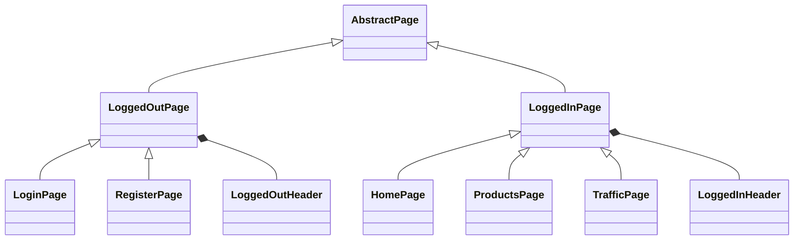

# 🧪 Test Automation in Practice 2025

A modern TypeScript-based test suite for validating both API and UI layers of a Dockerized AWS-like application stack, powered by awesome-localstack.

## 📦 Project Overview

This repository contains a comprehensive suite of automated tests using Playwright to validate the functionality of a full-stack application running in a local AWS-like environment provided by awesome-localstack.

## 🔧 Features

- **Comprehensive API Testing**: Validates 13+ endpoints covering authentication, user management, product operations, QR code generation, and traffic monitoring with full error handling scenarios.
- **Extensive UI Testing**: Ensures all major user interfaces work correctly, including login, registration, home page, navigation, and header components with accessibility considerations.
- **Page Object Model (POM)**: Implements a robust POM architecture with abstract base classes and specialized page objects for maintainable test code.
- **API Client Architecture**: Dedicated HTTP client classes for each endpoint with proper TypeScript typing and error handling.
- **Authentication Fixtures**: Reusable authentication helpers for both API and UI tests supporting admin and client user roles.
- **TypeScript Support**: Full TypeScript implementation for type safety, better developer experience, and maintainable test code.
- **Dockerized Environment**: Tests run against services provided by the awesome-localstack Docker setup with proper environment configuration.
- **WebSocket Testing**: Includes real-time traffic monitoring tests with WebSocket connections.
- **Test Data Management**: Proper test data creation, validation, and cleanup with factory patterns.

## 🗂️ Project Structure

```
.
├── tests/
│   ├── api/                        # API test specifications
│   │   ├── login.api.spec.ts       # Authentication endpoint tests
│   │   ├── signup.api.spec.ts      # User registration tests
│   │   ├── token.refresh.api.spec.ts # JWT refresh tests
│   │   ├── whoAmI.api.spec.ts      # Current user info tests
│   │   ├── getAllUsers.api.spec.ts # User management tests
│   │   ├── getUserByUsername.api.spec.ts # User lookup tests
│   │   ├── updateUser.api.spec.ts  # User update tests
│   │   ├── deleteUser.api.spec.ts  # User deletion tests
│   │   ├── getAllProducts.api.spec.ts # Product listing tests
│   │   ├── createProduct.api.spec.ts # Product creation tests
│   │   ├── createQrCode.api.spec.ts # QR code generation tests
│   │   ├── getTrafficInfo.api.spec.ts # Traffic monitoring tests
│   │   └── trafficWebSocket.api.spec.ts # WebSocket traffic tests
│   └── ui/                         # UI test specifications
│       ├── login.ui.spec.ts         # Login page tests
│       ├── register.ui.spec.ts      # Registration page tests
│       ├── home.ui.spec.ts          # Home page tests
│       └── loggedInHeader.ui.spec.ts # Navigation header tests
├── http/                           # API client implementations
│   ├── loginClient.ts              # Authentication client
│   ├── signupClient.ts             # Registration client
│   ├── tokenRefreshClient.ts       # JWT refresh client
│   ├── whoAmIClient.ts             # Current user client
│   ├── getAllUsersClient.ts        # User management client
│   ├── getUserByUsernameClient.ts  # User lookup client
│   ├── updateUserClient.ts         # User update client
│   ├── deleteUserClient.ts         # User deletion client
│   ├── getAllProductsClient.ts     # Product listing client
│   ├── createProductClient.ts      # Product creation client
│   ├── createQrCodeClient.ts       # QR code generation client
│   └── getTrafficInfoClient.ts     # Traffic monitoring client
├── pages/                          # Page Object Model classes
│   ├── abstractPage.ts             # Base page class
│   ├── loggedInPage.ts             # Base logged-in page
│   ├── loggedOutPage.ts            # Base logged-out page
│   ├── loginPage.ts                # Login page POM
│   ├── registerPage.ts             # Registration page POM
│   ├── homePage.ts                 # Home page POM
│   ├── productsPage.ts             # Products page POM
│   ├── usersPage.ts                # Users page POM
│   ├── profilePage.ts              # Profile page POM
│   ├── emailPage.ts                # Email page POM
│   ├── qrPage.ts                   # QR code page POM
│   ├── llmPage.ts                  # LLM page POM
│   ├── trafficPage.ts              # Traffic page POM
│   └── components/                 # Reusable page components
│       ├── loggedInHeader.ts       # Logged-in navigation
│       ├── loggedOutHeader.ts      # Logged-out navigation
│       └── toast.ts                # Toast notifications
├── fixtures/                       # Test fixtures and helpers
│   ├── apiAuth.ts                  # API authentication helpers
│   └── uiAuth.ts                   # UI authentication helpers
├── playwright.config.ts            # Playwright configuration
├── package.json                    # Project metadata and dependencies
└── ...
```

## 🚀 Getting Started

### Prerequisites

- Node.js LTS, Recommended `v22.16.0`
- Docker

### Setup

1. **Clone the Repository**

```bash
git clone https://github.com/slawekradzyminski/playwright-may-2025
cd playwright-may-2025
```

2. **Install Dependencies**

```bash
npm install
npx playwright install chromium
```

3. **Start the Dockerized Environment**

Follow the instructions in the awesome-localstack repository to set up and start the Docker containers. Ensure the following services are running:

- **Frontend**: Accessible at http://localhost:8081
- **Backend API**: Accessible at http://localhost:4001

4. **Run Tests**

**API Tests**

```bash
# Run all API tests
npx playwright test tests/api/

# Run specific API test suites
npx playwright test tests/api/login.api.spec.ts
npx playwright test tests/api/signup.api.spec.ts
npx playwright test tests/api/getAllUsers.api.spec.ts
```

**UI Tests**

```bash
# Run all UI tests
npx playwright test tests/ui/

# Run specific UI test suites
npx playwright test tests/ui/login.ui.spec.ts
npx playwright test tests/ui/register.ui.spec.ts
npx playwright test tests/ui/home.ui.spec.ts
```

**All Tests**

```bash
npx playwright test
```

**Test by Category**

```bash
# Authentication tests only
npx playwright test --grep "auth"

# User management tests only
npx playwright test --grep "user"

# Product tests only
npx playwright test --grep "product"
```

## ⚙️ Configuration

The `playwright.config.ts` file is configured to:

- Run tests in parallel for faster execution
- Use Chromium browser for UI tests
- Collect trace information on the first retry of a failed test
- Specify the test directory as `./tests`

## 🧪 Test Details

### API Test Coverage (13+ Endpoints)

The API test suite provides comprehensive coverage of the backend services with dedicated client classes and test specifications:

#### Authentication & User Management
- **`login.api.spec.ts`**: `/users/signin` endpoint with 200/400/422 scenarios
- **`signup.api.spec.ts`**: `/users/signup` endpoint with 201/400 scenarios and faker.js integration
- **`token.refresh.api.spec.ts`**: `/users/refresh` endpoint with 200/401 scenarios
- **`whoAmI.api.spec.ts`**: `/users/me` endpoint with 200/401 scenarios
- **`getAllUsers.api.spec.ts`**: `/users` endpoint with 200/401/403 scenarios (admin-only)
- **`getUserByUsername.api.spec.ts`**: `/users/{username}` GET with 200/401/404 scenarios
- **`updateUser.api.spec.ts`**: `/users/{username}` PUT with 200/400/401/403/404 scenarios
- **`deleteUser.api.spec.ts`**: `/users/{username}` DELETE with 204/401/403/404 scenarios

#### Product Management
- **`getAllProducts.api.spec.ts`**: `/api/products` GET with 200/401 scenarios
- **`createProduct.api.spec.ts`**: `/api/products` POST with 201/400/401/403 scenarios (admin-only)

#### Utility Services
- **`createQrCode.api.spec.ts`**: `/qr/create` endpoint with 200/400/401 scenarios and PNG validation
- **`getTrafficInfo.api.spec.ts`**: `/api/traffic/info` endpoint with 200/401 scenarios
- **`trafficWebSocket.api.spec.ts`**: WebSocket traffic monitoring with real-time connection tests

### UI Test Coverage (4+ Pages)

The UI test suite implements Page Object Model pattern with comprehensive user interface validation:

#### Authentication Pages
- **`login.ui.spec.ts`**: Login page with form validation, navigation, keyboard support, and accessibility
- **`register.ui.spec.ts`**: Registration page with form validation, success/error handling, and navigation

#### Application Pages
- **`home.ui.spec.ts`**: Home page with welcome message, CTA buttons, and authentication gating
- **`loggedInHeader.ui.spec.ts`**: Navigation header with role-based menus, cart badge, and mobile responsiveness

### Test Architecture Features

#### Page Object Model (POM)
- **Abstract Base Classes**: `AbstractPage`, `LoggedInPage`, `LoggedOutPage` for consistent page behavior
- **Specialized Pages**: Dedicated page objects for each UI component with reusable methods
- **Component Composition**: Reusable components like headers and toast notifications

#### API Client Architecture
- **Dedicated Clients**: One client class per endpoint with proper TypeScript typing
- **Error Handling**: Comprehensive error scenarios with proper HTTP status code validation
- **Authentication**: Bearer token injection and role-based access control testing

#### Test Fixtures & Helpers
- **`apiAuth.ts`**: API authentication helpers with user creation and token management
- **`uiAuth.ts`**: UI authentication helpers with localStorage token injection
- **Data Management**: Proper test data creation, validation, and cleanup patterns

## 🧰 Technologies Used

- **Playwright**: End-to-end testing framework for web applications
- **TypeScript**: Typed superset of JavaScript
- **Docker**: Containerization platform
- **awesome-localstack**: Dockerized local AWS environment for development and testing

## UI Page Object Model (POM) Diagram



### Textual Description for AI Agent

The system models different types of pages in a web application, separating logged-in and logged-out states.

- **AbstractPage**: Serves as the base class for all pages.
- **LoggedOutPage** (inherits from AbstractPage):
    - Has access to LoggedOutHeader (composition).
    - Specialised into:
        - LoginPage
        - RegisterPage
- **LoggedInPage** (inherits from AbstractPage):
    - Has access to LoggedInHeader (composition).
    - Specialised into:
        - HomePage
        - ProductsPage
        - TrafficPage

**Key distinction**:
- **Inheritance (blue)**: Defines specialisation of abstract/base pages.
- **Composition (green)**: Indicates that a page "has access to" or "contains" another component (e.g., a header).

## 📊 Test Coverage Status

### API Test Progress
Based on the comprehensive API test plan, the current implementation covers:

**✅ Completed (11 endpoints):**
- Authentication: `/users/signin`, `/users/signup`, `/users/refresh`, `/users/me`
- User Management: `/users`, `/users/{username}` (GET/PUT/DELETE)
- Products: `/api/products` (GET/POST)
- Utilities: `/qr/create`, `/api/traffic/info`
- WebSocket: Traffic monitoring with real-time connections

**⏳ Planned (20+ endpoints):**
- Cart operations: `/api/cart`, `/api/cart/items`
- Order management: `/api/orders`, `/api/orders/{id}`
- Admin operations: `/api/orders/admin`, `/api/orders/{id}/status`
- Email service: `/email`
- LLM integration: `/api/ollama/chat`, `/api/ollama/generate`
- System prompts: `/users/{username}/system-prompt`

### UI Test Progress
Based on the comprehensive UI test plan, the current implementation covers:

**✅ Completed (4 pages):**
- Authentication: Login, Register pages
- Application: Home page, Navigation header

**⏳ Planned (15+ pages):**
- Product management: Products list, Product details, Cart, Checkout
- User management: Users list, Edit user, Profile
- Admin features: Admin dashboard, Admin products, Admin orders
- Utility pages: Email, QR code, LLM, Traffic monitor
- Order management: Order details

### Test Architecture Maturity
- **Page Object Model**: Fully implemented with abstract base classes
- **API Client Architecture**: Complete with dedicated clients for each endpoint
- **Authentication Fixtures**: Comprehensive helpers for both API and UI tests
- **Test Data Management**: Proper creation, validation, and cleanup patterns
- **Error Handling**: Comprehensive HTTP status code validation and error scenarios

## Playwright MCP

Read more about Playwright MCP here: https://github.com/microsoft/playwright-mcp

## 📝 License

This project is licensed under the ISC License.

For more information on setting up and using the Dockerized environment, refer to the awesome-localstack repository.