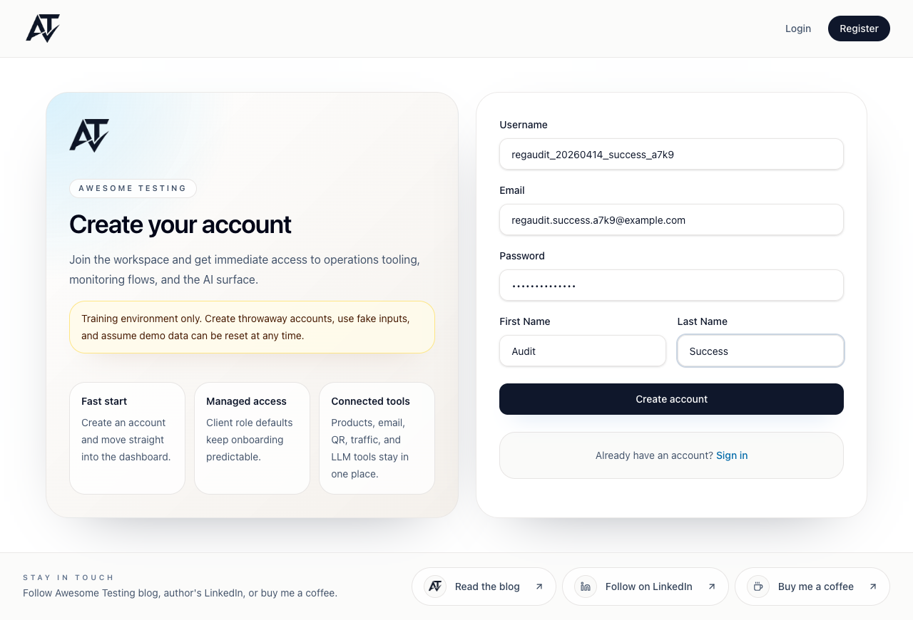
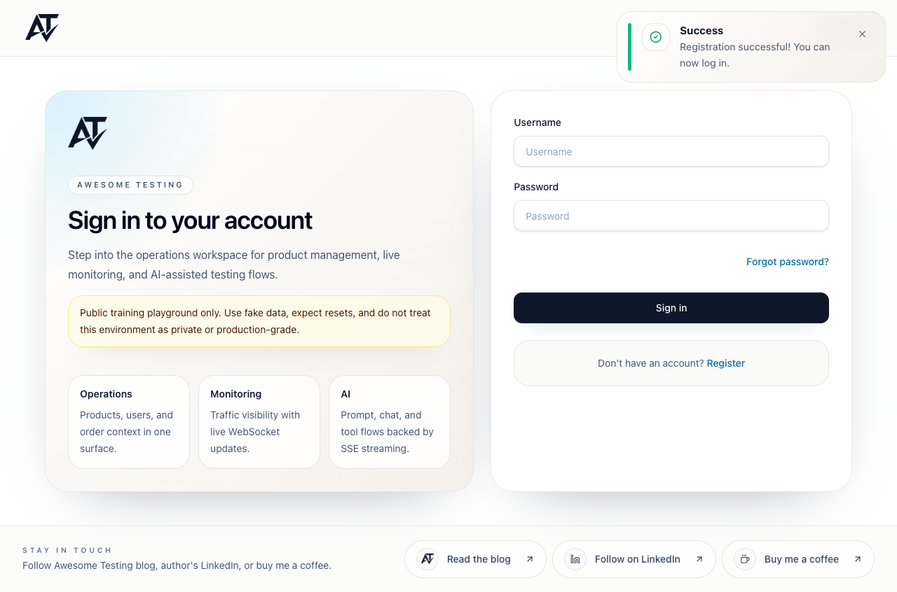
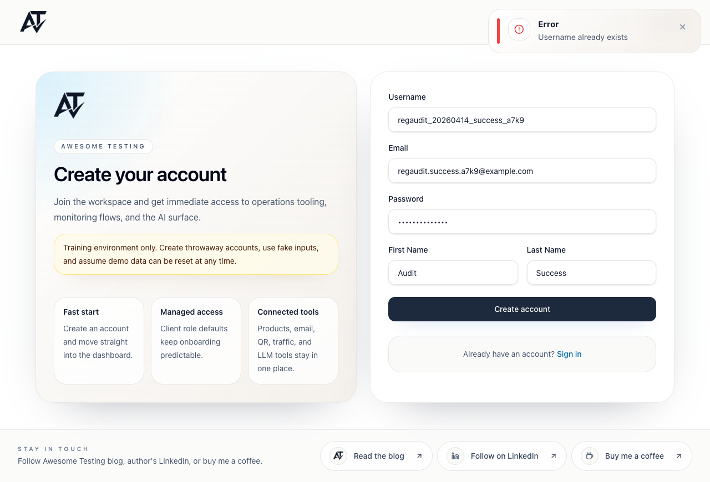
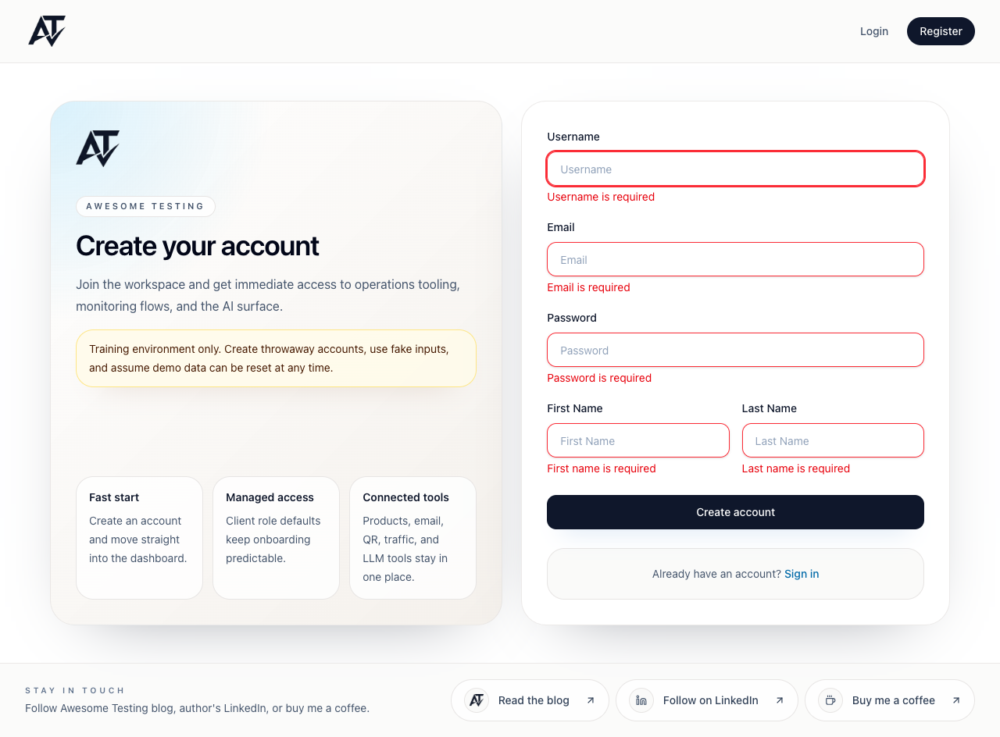
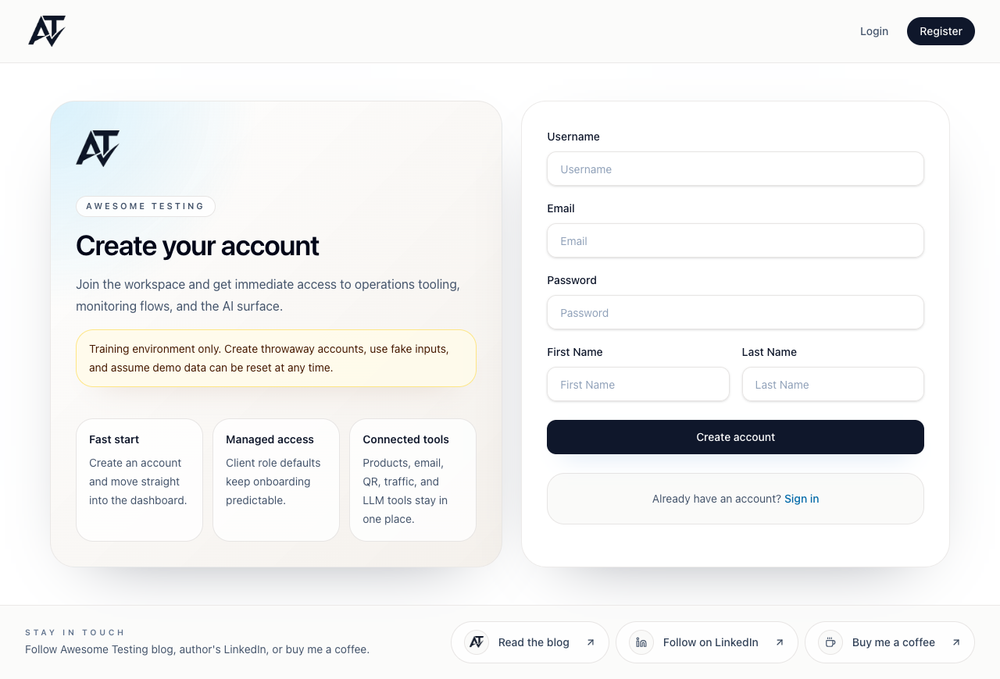
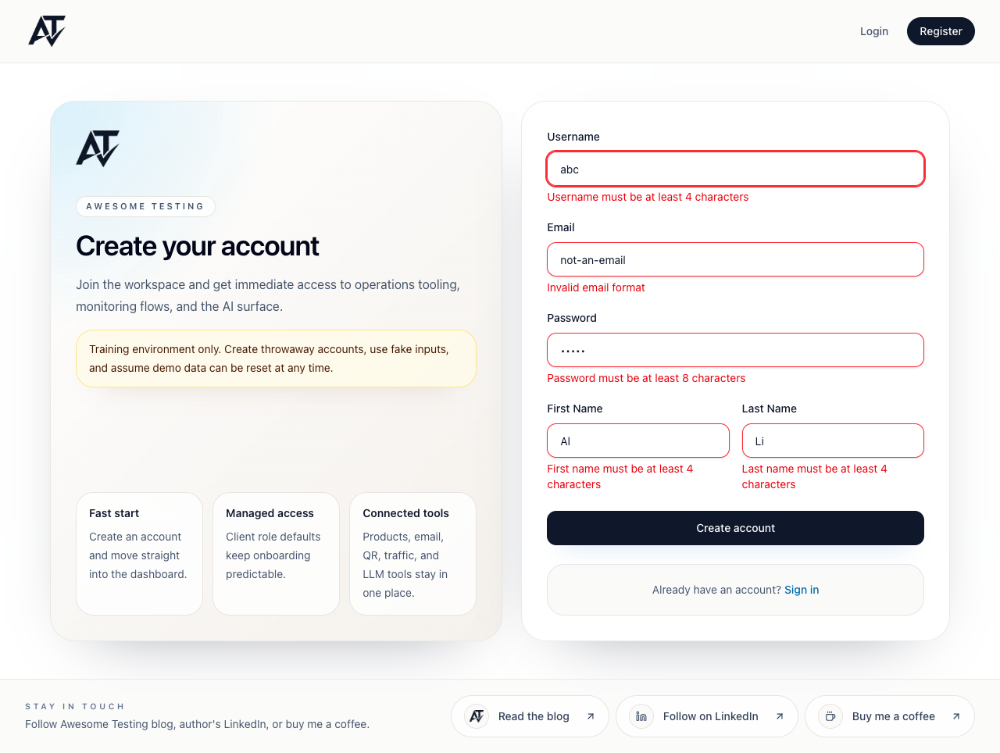

# Register Page Exploratory Testing Report

Date: 2026-04-14
Target: `http://localhost:8081/register`
Browser automation: `playwright-cli`
Playwright package: `1.59.1`
Evidence model: one independent trace, screencast video, screenshots, final snapshot, network summary, console summary, and script per case.

## How to Review

Open any trace bundle with Playwright Trace Viewer:

```bash
npx playwright show-trace artifacts/register-exploration-2026-04-14/traces/01-successful-register-trace.zip
npx playwright show-trace artifacts/register-exploration-2026-04-14/traces/02-duplicate-register-trace.zip
npx playwright show-trace artifacts/register-exploration-2026-04-14/traces/03-empty-submit-validation-trace.zip
npx playwright show-trace artifacts/register-exploration-2026-04-14/traces/04-invalid-field-validation-trace.zip
```

Open video receipts:

```bash
open artifacts/register-exploration-2026-04-14/videos/01-successful-register.webm
open artifacts/register-exploration-2026-04-14/videos/02-duplicate-register.webm
open artifacts/register-exploration-2026-04-14/videos/03-empty-submit-validation.webm
open artifacts/register-exploration-2026-04-14/videos/04-invalid-field-validation.webm
```

Open screenshots:

```bash
open artifacts/register-exploration-2026-04-14/screenshots
```

## Exploratory Testing Plan

| Case | Goal | Data | Expected result | Evidence |
|---|---|---|---|---|
| 01 | Successful registration | Unique valid user generated with `generators/userGenerator.ts` constraints | `POST /api/v1/users/signup` returns `201`, redirect to `/login`, success toast | Trace, screencast, before/filled/after screenshots |
| 02 | Duplicate registration failure | Reuse case 01 username/email | `POST /api/v1/users/signup` returns `400`, stay on `/register`, error toast | Trace, screencast, before/after screenshots |
| 03 | Empty form frontend validation | All fields blank | No signup request, stay on `/register`, all required messages visible | Trace, screencast, before/after screenshots |
| 04 | Invalid frontend validation | Short username/password/names and invalid email | No signup request, stay on `/register`, all min-length/format messages visible | Trace, screencast, before/after screenshots |

## Summary

| Case | Status | Route result | Network result | Main UI evidence |
|---|---|---|---|---|
| 01 successful register | Passed | `/register` -> `/login` | `POST /api/v1/users/signup => 201` | Success toast: `Registration successful! You can now log in.` |
| 02 duplicate register | Passed | stayed on `/register` | `POST /api/v1/users/signup => 400` | Error toast: `Username already exists` |
| 03 empty submit validation | Passed | stayed on `/register` | no API request | Required-field messages for username, email, password, first name, last name |
| 04 invalid field validation | Passed | stayed on `/register` | no API request | Min-length messages plus `Invalid email format` |

## Notable Findings

- Frontend duplicate username copy is `Username already exists`.
- Frontend invalid email copy is `Invalid email format`, while API tests/spec references use `Email should be valid`.
- Browser console showed Chrome verbose autocomplete suggestions for password inputs in every case. These are not test failures.
- Case 02 has an expected console resource error for the rejected `400` signup request.

## Case Details

### Case 01: Successful Register

Script: [scripts/01-successful-register.js](scripts/01-successful-register.js)
Trace: [traces/01-successful-register-trace.zip](traces/01-successful-register-trace.zip)
Video: [videos/01-successful-register.webm](videos/01-successful-register.webm)
Final snapshot: [snapshots/01-final.yaml](snapshots/01-final.yaml)
Console: [console/01-console.txt](console/01-console.txt)
Network: [network/01-network.txt](network/01-network.txt)

Data:

```json
{
  "username": "regaudit_20260414_success_a7k9",
  "email": "regaudit.success.a7k9@example.com",
  "password": "ClientPass123!",
  "firstName": "Audit",
  "lastName": "Success"
}
```

Screenshots:





### Case 02: Duplicate Register

Script: [scripts/02-duplicate-register.js](scripts/02-duplicate-register.js)
Trace: [traces/02-duplicate-register-trace.zip](traces/02-duplicate-register-trace.zip)
Video: [videos/02-duplicate-register.webm](videos/02-duplicate-register.webm)
Final snapshot: [snapshots/02-final.yaml](snapshots/02-final.yaml)
Console: [console/02-console.txt](console/02-console.txt)
Network: [network/02-network.txt](network/02-network.txt)

Observed:

- Same username/email as case 01 submitted.
- App stayed on `/register`.
- Toast title: `Error`.
- Toast description: `Username already exists`.
- Network: `POST /api/v1/users/signup => 400`.

Screenshots:




### Case 03: Empty Submit Validation

Script: [scripts/03-empty-submit-validation.js](scripts/03-empty-submit-validation.js)
Trace: [traces/03-empty-submit-validation-trace.zip](traces/03-empty-submit-validation-trace.zip)
Video: [videos/03-empty-submit-validation.webm](videos/03-empty-submit-validation.webm)
Final snapshot: [snapshots/03-final.yaml](snapshots/03-final.yaml)
Console: [console/03-console.txt](console/03-console.txt)
Network: [network/03-network.txt](network/03-network.txt)

Observed validation messages:

- `Username is required`
- `Email is required`
- `Password is required`
- `First name is required`
- `Last name is required`

Screenshots:




### Case 04: Invalid Field Validation

Script: [scripts/04-invalid-field-validation.js](scripts/04-invalid-field-validation.js)
Trace: [traces/04-invalid-field-validation-trace.zip](traces/04-invalid-field-validation-trace.zip)
Video: [videos/04-invalid-field-validation.webm](videos/04-invalid-field-validation.webm)
Final snapshot: [snapshots/04-final.yaml](snapshots/04-final.yaml)
Console: [console/04-console.txt](console/04-console.txt)
Network: [network/04-network.txt](network/04-network.txt)

Invalid data:

```json
{
  "username": "abc",
  "email": "not-an-email",
  "password": "short",
  "firstName": "Al",
  "lastName": "Li"
}
```

Observed validation messages:

- `Username must be at least 4 characters`
- `Invalid email format`
- `Password must be at least 8 characters`
- `First name must be at least 4 characters`
- `Last name must be at least 4 characters`

Screenshots:




## Screencast Coverage

Each case uses the Playwright 1.59 `page.screencast` API:

- `page.screencast.start({ path, size })` records a WebM video.
- `page.screencast.showActions({ position: 'top-right' })` annotates interactions.
- `page.screencast.showChapter(...)` adds human-readable case/result sections.
- `page.screencast.showOverlay(...)` adds short context overlays for data or intent.
- `page.screencast.stop()` finalizes the video receipt.

## Command Audit

Preflight:

```bash
node -e "const pkg=require('@playwright/test/package.json'); console.log(pkg.version)"
curl -s -o /dev/null -w '%{http_code} %{url_effective}\n' http://localhost:8081/register
playwright-cli -s=regprobe open http://localhost:8081/register
playwright-cli -s=regprobe --raw run-code "async page => typeof page.screencast + ' ' + Object.keys(page.screencast || {}).join(',')"
playwright-cli -s=regprobe --raw run-code "async page => ['start','stop','showActions','showChapter','showOverlay'].map(k => k + ':' + typeof page.screencast[k]).join(',')"
playwright-cli -s=regprobe close
```

Case 01:

```bash
playwright-cli -s=reg01 open http://localhost:8081/register
playwright-cli -s=reg01 tracing-start
playwright-cli -s=reg01 run-code --filename=artifacts/register-exploration-2026-04-14/scripts/01-successful-register.js
playwright-cli -s=reg01 snapshot --filename=artifacts/register-exploration-2026-04-14/snapshots/01-final.yaml
playwright-cli -s=reg01 console > artifacts/register-exploration-2026-04-14/console/01-console.txt
playwright-cli -s=reg01 network > artifacts/register-exploration-2026-04-14/network/01-network.txt
playwright-cli -s=reg01 tracing-stop
playwright-cli -s=reg01 close
```

Case 02:

```bash
playwright-cli -s=reg02 open http://localhost:8081/register
playwright-cli -s=reg02 tracing-start
playwright-cli -s=reg02 run-code --filename=artifacts/register-exploration-2026-04-14/scripts/02-duplicate-register.js
playwright-cli -s=reg02 snapshot --filename=artifacts/register-exploration-2026-04-14/snapshots/02-final.yaml
playwright-cli -s=reg02 console > artifacts/register-exploration-2026-04-14/console/02-console.txt
playwright-cli -s=reg02 network > artifacts/register-exploration-2026-04-14/network/02-network.txt
playwright-cli -s=reg02 tracing-stop
playwright-cli -s=reg02 close
```

Case 03:

```bash
playwright-cli -s=reg03 open http://localhost:8081/register
playwright-cli -s=reg03 tracing-start
playwright-cli -s=reg03 run-code --filename=artifacts/register-exploration-2026-04-14/scripts/03-empty-submit-validation.js
playwright-cli -s=reg03 snapshot --filename=artifacts/register-exploration-2026-04-14/snapshots/03-final.yaml
playwright-cli -s=reg03 console > artifacts/register-exploration-2026-04-14/console/03-console.txt
playwright-cli -s=reg03 network > artifacts/register-exploration-2026-04-14/network/03-network.txt
playwright-cli -s=reg03 tracing-stop
playwright-cli -s=reg03 close
```

Case 04:

```bash
playwright-cli -s=reg04 open http://localhost:8081/register
playwright-cli -s=reg04 tracing-start
playwright-cli -s=reg04 run-code --filename=artifacts/register-exploration-2026-04-14/scripts/04-invalid-field-validation.js
playwright-cli -s=reg04 snapshot --filename=artifacts/register-exploration-2026-04-14/snapshots/04-final.yaml
playwright-cli -s=reg04 console > artifacts/register-exploration-2026-04-14/console/04-console.txt
playwright-cli -s=reg04 network > artifacts/register-exploration-2026-04-14/network/04-network.txt
playwright-cli -s=reg04 tracing-stop
playwright-cli -s=reg04 close
```

Packaging commands used after each `tracing-stop` copied the matching loose `.trace`, `.network`, and `resources/` directory into a temporary folder and zipped them into `artifacts/register-exploration-2026-04-14/traces/*-trace.zip`.

Harness corrections made during exploration:

- Case 02 first expected `already in use`; product returned `Username already exists`. The assertion was corrected and the case was rerun with a clean final trace.
- Case 03 first used `new URL(page.url())`; the `playwright-cli run-code` environment did not expose the `URL` global. The check was changed to `page.url().endsWith('/register')` and rerun.
- Case 04 first expected `Email should be valid`; product returned `Invalid email format`. The assertion was corrected and the case was rerun with a clean final trace.
