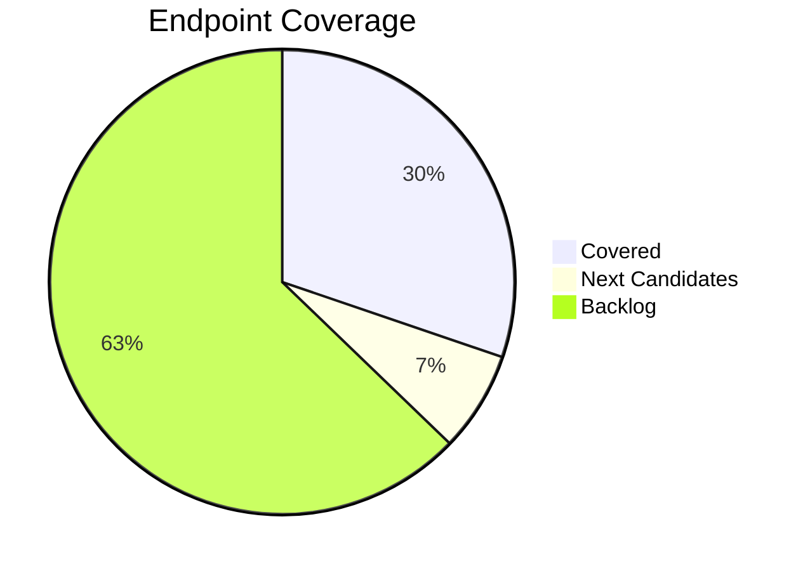
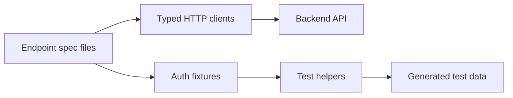

# API Automation Progress Report

**Date:** 13 April 2026  
**Scope:** Playwright API automation for the documented backend in `api-docs.json`

## Executive Snapshot

| Metric | Result |
| --- | ---: |
| Commits delivered today | **10** |
| Files changed | **43** |
| Net code/documentation added | **+4,900 lines** |
| API spec files now organized | **14** |
| API tests implemented | **46** |
| Automated API run | **46 / 46 passing** |
| Documented endpoints covered | **13 / 43** |



## What Was Delivered

### 1. API Test Foundation

Created a reusable, typed testing layer instead of one-off request calls:



Key additions:

- Endpoint-specific HTTP clients for users, auth, products, cart, and orders.
- Stronger shared models in `types/`.
- User and product generators for isolated, disposable test data.
- Auth fixtures for regular users and admin-only flows.
- Helper assertions for reusable product contract validation.

### 2. Coverage Expansion

Coverage now spans the main business-critical flows:

| Area | Covered Today |
| --- | --- |
| Users/Auth | signup, signin, me, refresh, logout |
| Products | list, get by id, admin create, admin update, admin delete |
| Cart | get cart, add item, clear cart |
| Orders | admin order listing |

The tests validate successful paths and important negative cases such as `400`, `401`, `403`, `404`, and `422` responses.

### 3. Test Suite Structure

The API suite was reorganized into maintainable resource folders:

```text
tests/api/
├── cart/
├── orders/
├── products/
├── users/
├── fixtures/
└── helpers/
```

This makes ownership clear, keeps each endpoint in its own spec file, and supports safe parallel execution.

### 4. Delivery Plan

Added a practical API test plan with:

- Full endpoint inventory from `api-docs.json`.
- Coverage status tracking.
- Recommended delivery order.
- Rules for admin tests, shared seeded data, and serial state transitions.

## Validation

```text
npm run test:api
46 passed in 13.5s
```

The suite is green and currently runs successfully in parallel.

## Next Steps

1. Complete the remaining cart lifecycle endpoints: update item and remove item.
2. Add order creation and user-facing order list/detail tests.
3. Cover password reset using local email outbox verification.
4. Expand user management and prompt preference coverage after confirming role rules with `curl`.
5. Add CI-friendly reporting once the API suite becomes part of the regular pipeline.

## Bottom Line

Today converted the project from a small initial API test set into a structured automation platform: typed clients, reusable fixtures, generated test data, organized endpoint specs, a tracked coverage plan, and a passing 46-test regression suite.
